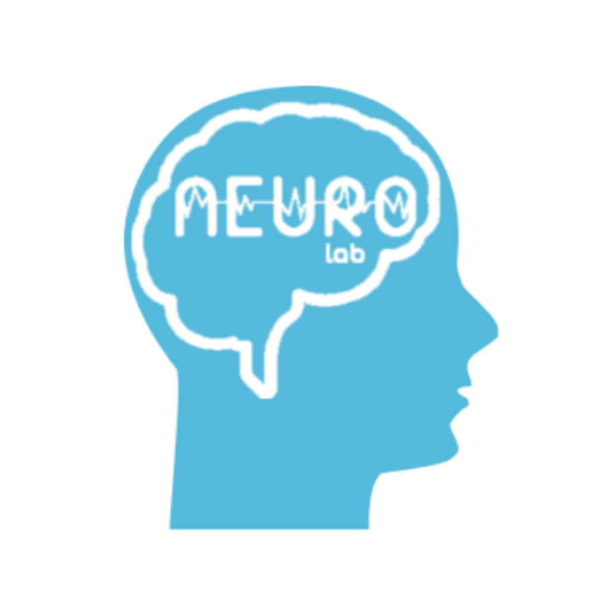

# EEGPhasePy

[](https://github.com/AmeerHamoodi/EEGPhasePy/actions/workflows/lint-and-test.yml)
[](https://codecov.io/gh/AmeerHamoodi/EEGPhasePy)
[](https://pypi.org/project/eegphasepy/)
[](https://pypi.org/project/eegphasepy/)
[](https://opensource.org/licenses/BSD-3-Clause)

A toolkit for developing and analyzing real-time and pseudo-real-time EEG phase estimation.

EEGPhasePy includes implementations of various EEG phase estimation algorithms — including Educated Temporal Prediction (ETP) and PHASTIMATE (autoregressive) — alongside offline analysis helpers for evaluating phase estimation experiments. For background on EEG phase estimation and its applications, see [Zrenner & Ziemann (2024)](https://pmc.ncbi.nlm.nih.gov/articles/PMC10881194/). More phase estimators will continue to be added in the future.

## Features

- **ETP** — Educated Temporal Prediction ([Shirinpour et al., 2020](https://pmc.ncbi.nlm.nih.gov/articles/PMC8293904/)): uses average interpeak-interval to determine time to next target phase. Similar accuracy to AR with the added benefit of working well with amplifiers that have low packet send rates.
- **PHASTIMATE** — Autoregressive phase estimator ([Zrenner et al., 2020](https://pubmed.ncbi.nlm.nih.gov/29191438/)): uses an AR model to compensate for filter edge effects and extracts instantaneous phase via the Hilbert transform. Estimates ongoing phase rather than predicting.
- **Parameter optimization** — Bayesian and genetic optimization (via `bayesian-optimization` and `PyGAD`) over AR order and window edge for PHASTIMATE. Improve accuracy of the AR model on a participant-by-participant basis.
- **Visualization** — Polar phase histograms and average ± std pre/post-trigger waveforms via `matplotlib`.
- Supports Python 3.9–3.13.

## Documentation

Full documentation including API reference, usage guides, and examples is available at [eegphasepy.readthedocs.io](https://eegphasepy.readthedocs.io).

### Table of contents

| Section        | Pages                                                                                                                                                                                                                                                                               |
| -------------- | ----------------------------------------------------------------------------------------------------------------------------------------------------------------------------------------------------------------------------------------------------------------------------------- |
| **Guide**      | [What is EEG phase estimation?](https://eegphasepy.readthedocs.io/en/latest/usage/guide.html) · [Real-time phase estimation](https://eegphasepy.readthedocs.io/en/latest/usage/realtime.html)                                                                                       |
| **Models**     | [ETP-based phase estimation](https://eegphasepy.readthedocs.io/en/latest/usage/etp.html) · [Autoregressive phase estimation](https://eegphasepy.readthedocs.io/en/latest/usage/ar.html)                                                                                             |
| **Optimizing** | [Bayesian optimization of PHASTIMATE](https://eegphasepy.readthedocs.io/en/latest/usage/bayesian_optimization.html) · [Genetic optimization of PHASTIMATE](https://eegphasepy.readthedocs.io/en/latest/usage/genetic_optimization.html)                                             |
| **Analysis**   | [Waveform plots](https://eegphasepy.readthedocs.io/en/latest/usage/waveform_plots.html) · [Polar histograms](https://eegphasepy.readthedocs.io/en/latest/usage/polar_histograms.html) · [Phase estimation statistics](https://eegphasepy.readthedocs.io/en/latest/usage/stats.html) |
| **Examples**   | [Gallery](https://eegphasepy.readthedocs.io/en/latest/gallery_examples/index.html)                                                                                                                                                                                                  |
| **Reference**  | [API reference](https://eegphasepy.readthedocs.io/en/latest/api.html)                                                                                                                                                                                                               |

## Installation

```bash
pip install eegphasepy
```

## Quick start

### Setting up a model

Select the model you plan to run phase estimation with. Below we use ETP; see the [models documentation](https://eegphasepy.readthedocs.io/en/latest/usage/etp.html) for all available estimators.

```python
import numpy as np
import scipy.signal as signal
from EEGPhasePy.estimators import ETP

fs = 2000
window_len = 2 * fs        # 2 s rolling buffer
packet_size = int(0.06 * fs)  # samples per amplifier packet (~60 ms)

rt_filter = signal.firwin(120, [8, 12], fs=fs, pass_zero=False)
gt_filter = signal.firwin(300, [8, 12], fs=fs, pass_zero=False)

etp = ETP(rt_filter, gt_filter, fs)
etp.fit(training_signal, min_ipi=int(fs * 1/12))
```

### Real-time phase estimation

In a live experiment your amplifier sends packets of samples at a fixed rate. On each packet arrival you append the new samples to a rolling buffer, run ETP on that buffer, and schedule a trigger to fire at the sample offset ETP returns. `predict` returns the number of samples from the end of the current window at which the target phase is expected — converting that to wall-clock time (`offset / fs`) gives you how far in the future to schedule the stimulus.

```python
import collections, time

buffer = collections.deque(maxlen=window_len)  # auto-drops oldest samples
triggers = []

# In a real experiment this would be a while loop reading packets from your amplifier
for packet_start in range(0, len(testing_signal) - packet_size, packet_size):
    packet = testing_signal[packet_start:packet_start + packet_size]
    buffer.extend(packet)

    if len(buffer) < window_len:
        continue  # wait until the buffer is full

    window = np.array(buffer)
    try:
        offset = etp.predict(window, target_phase=0)  # predict next peak
        trigger_time = time.time() + offset / fs      # absolute wall-clock time
        trigger_sample = packet_start + packet_size + offset
        triggers.append(trigger_sample)

        # schedule_trigger(trigger_time)  # call your hardware trigger here
    except RuntimeError:
        pass  # no peaks found in this window
```

### Analysing the output

In raw EEG you would typically have trigger markers stored as annotations in your EEG file. EEGPhasePy just needs the sample number each trigger occurs at to analyze the outcome of your phase estimation experiment.

```python
mean_phase = etp.mean_phase_from_triggers(testing_signal, triggers, degree=True)
std_phase  = etp.std_phase_from_triggers(testing_signal, triggers, degree=True)
accuracy   = etp.phase_accuracy_from_triggers(testing_signal, triggers, 0)

print(f"Mean phase: {mean_phase:.1f}°  |  Std: {std_phase:.1f}°  |  Accuracy: {accuracy * 100:.1f}%")
```

`mean_phase_from_triggers` and `std_phase_from_triggers` return the circular mean and standard deviation of the phase at each trigger (a std of 50°–70° is typical in published studies). `phase_accuracy_from_triggers` returns a 0–1 score where 0.5 is chance, 0 is anti-phase, and 1 is perfect locking.

### Visualization

```python
import EEGPhasePy.viz as viz

# Polar histogram of triggered phases
polar_fig = etp.polar_histogram_from_triggers(testing_signal, triggers)

# Average ± std waveform around trigger events
waveform_fig = etp.plot_mean_std_waveform_from_triggers(
    testing_signal, triggers, tmin=0.1, tmax=0.1
)
```

Both functions return a `matplotlib.figure.Figure`. See the [waveform plots](https://eegphasepy.readthedocs.io/en/latest/usage/waveform_plots.html) and [polar histograms](https://eegphasepy.readthedocs.io/en/latest/usage/polar_histograms.html) documentation for color and style customization options.

## Contributing

Contributions are welcome. Please open an issue or pull request on [GitHub](https://github.com/AmeerHamoodi/EEGPhasePy).

## Citation

If you use EEGPhasePy in your research, please cite the package and the underlying algorithm(s) you end up using:

- **ETP**: Shirinpour et al. (2020). _Experimental Evaluation of Methods for Real-Time EEG Phase-Specific Transcranial Magnetic Stimulation_. [PMC8293904](https://pmc.ncbi.nlm.nih.gov/articles/PMC8293904/)
- **PHASTIMATE**: Zrenner et al. (2020). _The shaky ground truth of real-time phase estimation_. [PMID 29191438](https://pubmed.ncbi.nlm.nih.gov/29191438/)

```bibtex
@software{hamoodi_2026_21854656,
  author       = {Hamoodi, Ameer and
                  Brodbeck, Christian and
                  Hussain, Mustaali and
                  Nelson, Aimee},
  title        = {EEGPhasePy: A toolbox for real-time EEG phase
                   estimation
                  },
  month        = aug,
  year         = 2026,
  publisher    = {Zenodo},
  version      = {0.0.8},
  doi          = {10.5281/zenodo.21854656},
  url          = {https://doi.org/10.5281/zenodo.21854656},
}
```

## Licence

BSD 3-Clause Licence. See [LICENCE](LICENCE) for details.

## Acknowledgements

 
